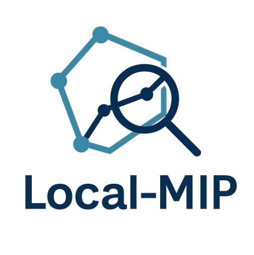

  

# Local-MIP

一个关于本地混合整数规划的研究项目。

**导航**: [首页](/) | [Get Started](get-started.md) | [下载](download.md)

## 关于项目

在这里介绍你的项目背景和目标。

## 主要内容

### 软件工具

- [工具1](#) - 工具1的简要描述
- [工具2](#) - 工具2的简要描述

### 研究论文

#### 2024年

- **论文标题1** - 作者名. *会议/期刊名*, 年份. [[PDF](#)] [[补充材料](#)]
- **论文标题2** - 作者名. *会议/期刊名*, 年份. [[PDF](#)]

#### 2023年

- **论文标题3** - 作者名. *会议/期刊名*, 年份. [[PDF](#)]

### 相关资源

- [Get Started](get-started.md) - 快速入门指南
- [下载](download.md) - 获取最新版本
- [文档](docs.md) - Markdown使用指南

## 联系方式

- GitHub: [Local-MIP](https://github.com/Local-MIP)
- Email: your-email@example.com

---

最后更新：2025年1月
